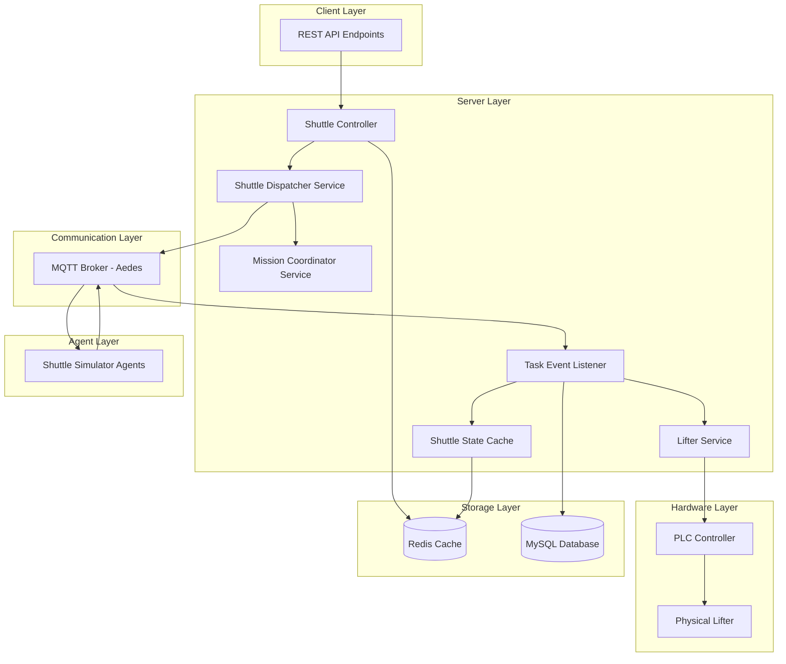
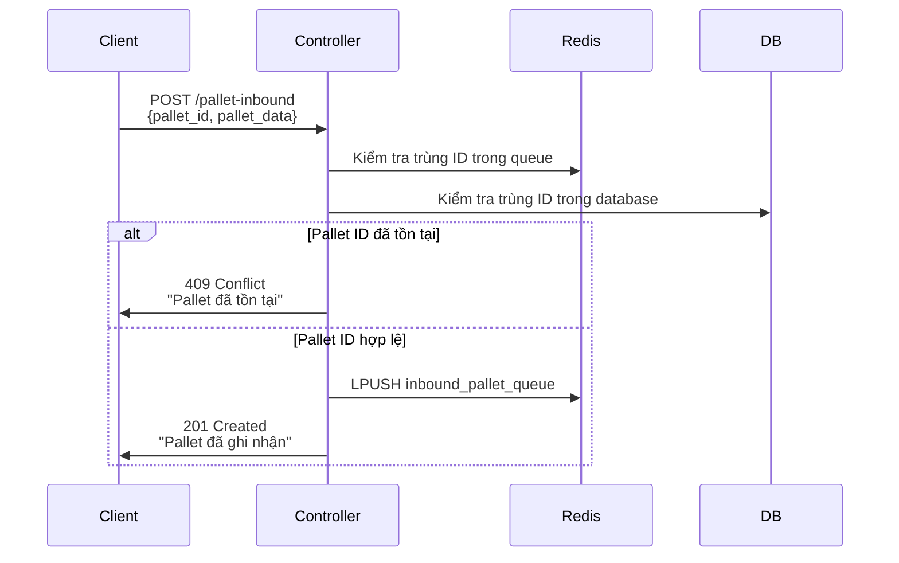
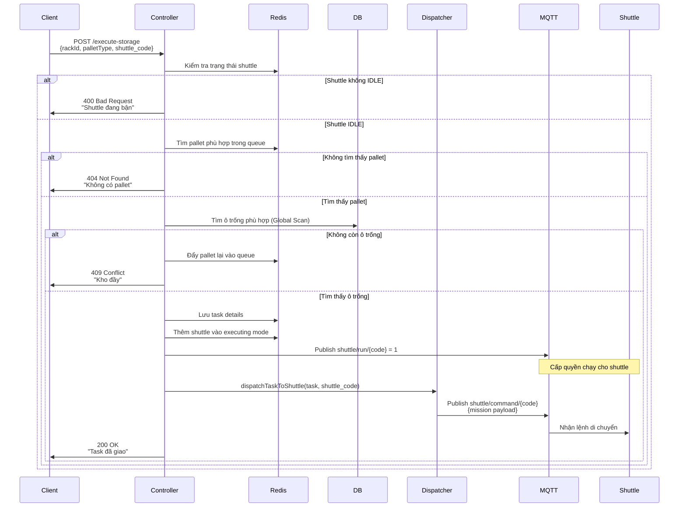
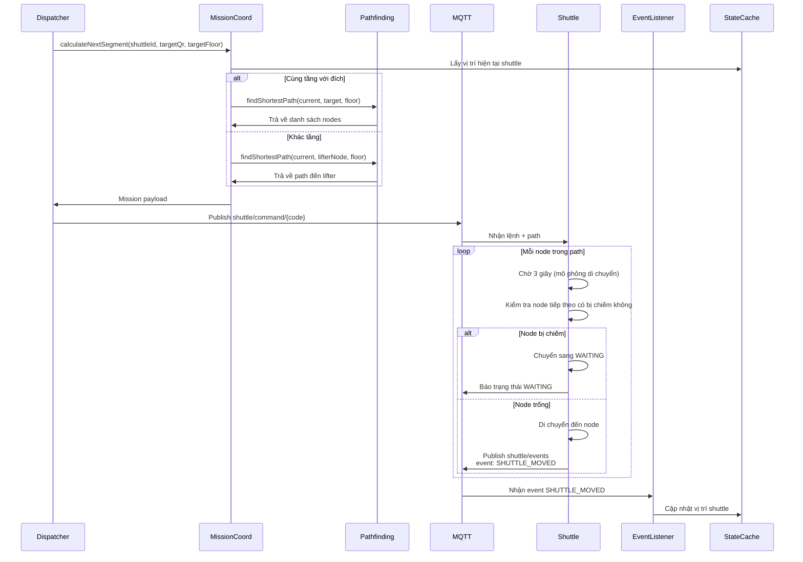
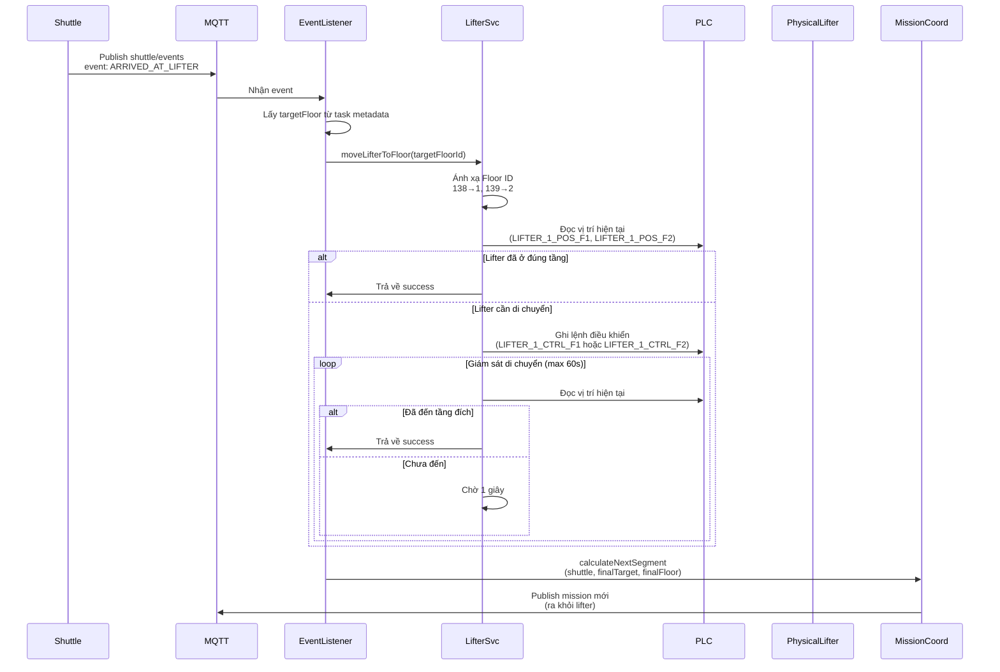
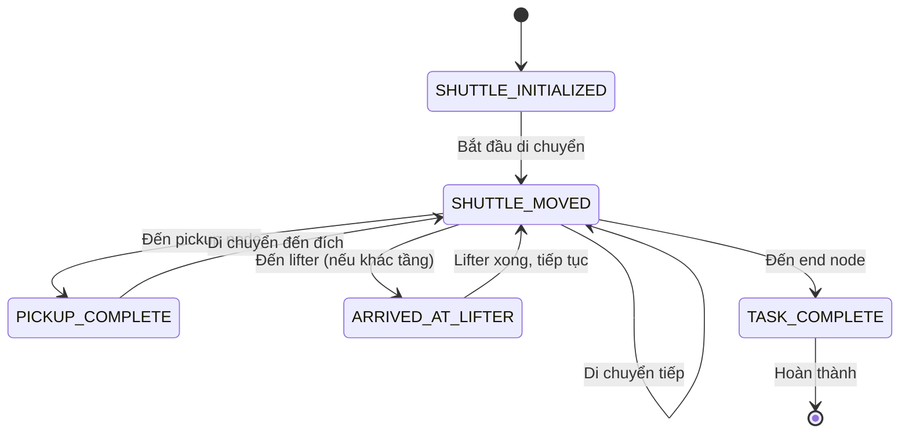

# Hệ thống Điều phối Kho Tự động (WCS - Warehouse Control System)

Hệ thống điều khiển và quản lý kho tự động sử dụng **Shuttle** (xe tự hành), **Lifter** (thang máy), và **PLC** (Programmable Logic Controller) để thực hiện các nhiệm vụ nhập kho, xuất kho và di chuyển pallet giữa các tầng.

---

## 📋 Mục lục

- [Tổng quan Kiến trúc](#-tổng-quan-kiến-trúc)
- [Các Thành phần Chính](#-các-thành-phần-chính)
- [Luồng Hoạt động Chi tiết](#-luồng-hoạt-động-chi-tiết)
  - [1. Luồng Nhập hàng (Inbound Flow)](#1-luồng-nhập-hàng-inbound-flow)
  - [2. Luồng Thực thi Lưu kho (Storage Execution Flow)](#2-luồng-thực-thi-lưu-kho-storage-execution-flow)
  - [3. Luồng Di chuyển Shuttle](#3-luồng-di-chuyển-shuttle)
  - [4. Luồng Điều khiển Lifter](#4-luồng-điều-khiển-lifter)
  - [5. Luồng Xử lý Sự kiện](#5-luồng-xử-lý-sự-kiện)
- [Tích hợp PLC](#-tích-hợp-plc)
- [Endpoints API](#-endpoints-api)
- [Khái niệm Quan trọng](#-khái-niệm-quan-trọng)

---

## 🏗️ Tổng quan Kiến trúc

Hệ thống sử dụng **kiến trúc hướng sự kiện** (Event-Driven Architecture) thông qua **MQTT Broker** để đảm bảo giao tiếp real-time giữa các thành phần.



---

## 🔧 Các Thành phần Chính

### **1. Shuttle (Xe tự hành)**

Shuttle là các agent tự động di chuyển pallet trong kho. Mỗi shuttle có khả năng:
- **Tự chủ di chuyển**: Thực thi lộ trình được giao với độ trễ mô phỏng (3 giây/node)
- **Xử lý xung đột**: Kiểm tra và chờ đợi khi node tiếp theo bị chiếm giữ
- **Báo cáo trạng thái**: Gửi thông tin vị trí, trạng thái, và sự kiện qua MQTT
- **Nhận lệnh**: Lắng nghe lệnh di chuyển từ server

**Các trạng thái Shuttle:**
- `IDLE (8)`: Rảnh, sẵn sàng nhận nhiệm vụ
- `MOVING`: Đang di chuyển
- `WAITING`: Chờ đợi node bị chiếm giữ được giải phóng
- `PICKING_UP`: Đang nhận hàng
- `DROPPING_OFF`: Đang thả hàng
- `AT_LIFTER`: Đang ở vị trí lifter

---

### **2. Lifter (Thang máy)**

Lifter là thiết bị vật lý di chuyển shuttle giữa các tầng, được điều khiển qua **PLC**.

**Chức năng:**
- Di chuyển shuttle từ tầng này sang tầng khác
- Xác nhận vị trí hiện tại qua sensor PLC
- Hỗ trợ hàng đợi ưu tiên cho các yêu cầu khác tầng

**Ánh xạ Tầng:**
- Database Floor ID `138` → Lifter Physical Floor `1`
- Database Floor ID `139` → Lifter Physical Floor `2`

---

### **3. PLC (Programmable Logic Controller)**

PLC điều khiển các thiết bị vật lý như lifter thông qua giao thức **S7 Communication**.

**Biến PLC cho Lifter 1** (định nghĩa trong `tag_plc_1.js`):
- `LIFTER_1_ERROR (DB1,X0.0)`: Thông báo lỗi lifter
- `LIFTER_1_POS_F1 (DB1,X0.1)`: Xác nhận lifter đang ở tầng 1
- `LIFTER_1_POS_F2 (DB1,X0.2)`: Xác nhận lifter đang ở tầng 2
- `LIFTER_1_CTRL_F1 (DB1,X0.3)`: Điều khiển lifter di chuyển đến tầng 1
- `LIFTER_1_CTRL_F2 (DB1,X0.4)`: Điều khiển lifter di chuyển đến tầng 2

---

### **4. MQTT Broker**

Trung tâm giao tiếp sử dụng **Aedes MQTT Broker** chạy trên cổng `1883`.

**Topics quan trọng:**
- `shuttle/command/{shuttle_code}`: Server gửi lệnh di chuyển đến shuttle
- `shuttle/information/{shuttle_code}`: Shuttle báo cáo trạng thái
- `shuttle/events`: Shuttle gửi sự kiện (MOVED, PICKUP_COMPLETE, TASK_COMPLETE, ARRIVED_AT_LIFTER)
- `shuttle/run/{shuttle_code}`: Server gửi quyền chạy cho shuttle (0 = dừng, 1 = chạy)

---

### **5. Redis Cache**

Lưu trữ trạng thái tạm thời và hàng đợi:
- `shuttle:state:{shuttle_code}`: Trạng thái real-time của shuttle
- `shuttle:inbound_pallet_queue`: Hàng đợi pallet chờ nhập kho
- `task:staging_queue`: Hàng đợi task chờ xử lý
- `shuttle:task:{taskId}`: Chi tiết task đang thực thi
- `batch:master:{batchId}`: Thông tin batch xử lý hàng loạt

---

### **6. MySQL Database**

Lưu trữ dữ liệu lâu dài:
- **cells**: Thông tin ô kệ (vị trí, loại, trạng thái, QR code)
- **floors**: Thông tin tầng
- **racks**: Thông tin kệ
- **nodes**: Các điểm di chuyển trong kho
- **edges**: Các cạnh kết nối giữa các node (cho pathfinding)

---

## 🔄 Luồng Hoạt động Chi tiết

### **1. Luồng Nhập hàng (Inbound Flow)**

Endpoint: **`POST /api/v1/shuttle/pallet-inbound`**

#### **Mục đích**
Đăng ký pallet mới vào hệ thống và đưa vào hàng đợi chờ xử lý.

#### **Các bước thực hiện**



#### **Chi tiết từng bước**

**Bước 1: Nhận yêu cầu**
- Client gửi thông tin pallet với `pallet_id` (mã định danh) và `pallet_data` (loại pallet)

**Bước 2: Kiểm tra trùng lặp**
- Hệ thống kiểm tra `pallet_id` trong:
  - Hàng đợi `inbound_pallet_queue` (Redis)
  - Hàng đợi `task:staging_queue` (Redis)
  - Các task đang thực thi `shuttle:task:*` (Redis)
  - Database (bảng cells - đã lưu kho)

**Bước 3: Đưa vào hàng đợi**
- Nếu không trùng, tạo object:
  ```json
  {
    "palletId": "PALLET_001",
    "palletType": "TYPE_A",
    "timestamp": 1737529139000
  }
  ```
- Push vào Redis List `shuttle:inbound_pallet_queue` (FIFO)

**Bước 4: Phản hồi**
- Trả về HTTP 201 với thông tin pallet đã đăng ký

---

### **2. Luồng Thực thi Lưu kho (Storage Execution Flow)**

Endpoint: **`POST /api/v1/shuttle/execute-storage`**

#### **Mục đích**
Kích hoạt nhiệm vụ lưu kho cho một shuttle cụ thể, lấy pallet từ hàng đợi và giao nhiệm vụ.

#### **Các bước thực hiện**



#### **Chi tiết từng bước**

**Bước 1: Xác thực đầu vào**
- Kiểm tra `rackId`, `palletType`, `shuttle_code` có đầy đủ không
- Lấy trạng thái shuttle từ `shuttleStateCache`
- Kiểm tra shuttle có ở trạng thái `IDLE (8)` không

**Bước 2: Tìm pallet phù hợp**
- Duyệt hàng đợi `inbound_pallet_queue` từ cuối (RPOP)
- Tìm pallet có `palletType` khớp
- Nếu không khớp, đẩy lại vào đầu queue (LPUSH) để giữ thứ tự FIFO

**Bước 3: Xác định điểm lấy hàng (Pickup Node)**
- Lấy cấu hình từ `shuttle.config.js` theo `rackId`
- Truy vấn database để lấy thông tin chi tiết của `pickupNodeQr` (QR code, floor_id)

**Bước 4: Tìm ô trống (Global Storage Discovery)**
- Gọi `CellRepository.findAvailableNodesByFIFO(palletType)`
- Tìm kiếm trên **toàn bộ warehouse** (tất cả các tầng)
- Ưu tiên theo `floor_id` thấp trước (FIFO)
- Nếu không tìm thấy, trả pallet về queue và báo lỗi "kho đầy"

**Bước 5: Tạo Task Object**
```json
{
  "taskId": "man_1737529139000_001",
  "pickupNodeQr": "X0001Y0001",
  "pickupNodeFloorId": 138,
  "endNodeQr": "X0005Y0003",
  "endNodeFloorId": 139,
  "endNodeCol": 5,
  "endNodeRow": 3,
  "palletType": "TYPE_A",
  "itemInfo": "PALLET_001",
  "targetRow": 3,
  "targetFloor": 139,
  "assignedShuttleId": "001",
  "status": "pending",
  "timestamp": 1737529139000
}
```

**Bước 6: Lưu Task vào Redis**
- Lưu chi tiết task vào `shuttle:task:{taskId}` (Redis Hash)
- Thêm shuttle vào `executing_mode` (Redis Set)

**Bước 7: Cấp quyền chạy**
- Publish MQTT message đến topic `shuttle/run/{shuttle_code}` với payload `"1"`
- Shuttle nhận được quyền chạy và sẵn sàng nhận mission

**Bước 8: Dispatch Task**
- Gọi `shuttleDispatcherService.dispatchTaskToShuttle(task, shuttle_code)`
- Dispatcher tính toán lộ trình và gửi lệnh qua MQTT

**Bước 9: Phản hồi**
- Trả về HTTP 200 với `taskId`, `palletId`, và `destination`

---

### **3. Luồng Di chuyển Shuttle**

#### **Các bước thực hiện**



#### **Chi tiết từng bước**

**Bước 1: Tính toán lộ trình (Mission Coordinator)**
- Lấy vị trí hiện tại của shuttle từ `shuttleStateCache`
- Xác định đích đến cuối cùng (`finalTargetQr`, `finalTargetFloorId`)
- Kiểm tra shuttle có cùng tầng với đích không

**Bước 2: Pathfinding**

**Trường hợp 1: Cùng tầng**
- Gọi `findShortestPath(currentQr, targetQr, floorId)`
- Sử dụng thuật toán **A*** để tìm đường đi ngắn nhất
- Tính đến các ràng buộc:
  - Hướng di chuyển một chiều trong row (LEFT_TO_RIGHT hoặc RIGHT_TO_LEFT)
  - Tránh các node bị chiếm giữ
  - Ưu tiên các node có trọng số thấp

**Trường hợp 2: Khác tầng**
- Tìm lifter node trên tầng hiện tại (QR code đặc biệt: `X5555Y5555`)
- Tính path từ vị trí hiện tại đến lifter node
- Đích tạm thời là lifter, đích cuối cùng được lưu trong task metadata

**Bước 3: Tạo Mission Payload**
```json
{
  "missionId": "mission_1737529139000",
  "taskId": "man_1737529139000_001",
  "action": "MOVE_TO_PICKUP",
  "path": ["X0001Y0001", "X0002Y0001", "X0003Y0001"],
  "targetQr": "X0003Y0001",
  "isCarrying": false,
  "itemInfo": "PALLET_001",
  "metadata": {
    "finalTargetQr": "X0005Y0003",
    "finalTargetFloorId": 139
  }
}
```

**Bước 4: Gửi lệnh qua MQTT**
- Publish đến topic `shuttle/command/{shuttle_code}`
- Sử dụng cơ chế **retry với timeout 30 giây**
- Retry mỗi 500ms nếu không nhận được acknowledgment

**Bước 5: Shuttle thực thi**
- Shuttle nhận mission payload
- Lưu path vào bộ nhớ nội bộ
- Bắt đầu di chuyển từng node một

**Bước 6: Di chuyển từng node**
- Chờ 3 giây (mô phỏng thời gian di chuyển)
- Kiểm tra node tiếp theo có bị chiếm giữ không (qua Redis)
- Nếu bị chiếm: Chuyển sang trạng thái `WAITING` và chờ
- Nếu trống: Di chuyển và publish event `SHUTTLE_MOVED`

**Bước 7: Báo cáo sự kiện**
- Shuttle publish đến topic `shuttle/events`:
```json
{
  "event": "SHUTTLE_MOVED",
  "shuttleId": "001",
  "currentQr": "X0002Y0001",
  "taskId": "man_1737529139000_001",
  "timestamp": 1737529142000
}
```

**Bước 8: Cập nhật State Cache**
- `TaskEventListener` nhận event
- Cập nhật `shuttleStateCache` với vị trí mới
- Giải phóng node cũ, chiếm giữ node mới

---

### **4. Luồng Điều khiển Lifter**

#### **Khi nào Lifter được kích hoạt?**
- Khi shuttle cần di chuyển từ tầng này sang tầng khác
- Khi shuttle đến node lifter và phát sự kiện `ARRIVED_AT_LIFTER`

#### **Các bước thực hiện**



#### **Chi tiết từng bước**

**Bước 1: Shuttle đến Lifter**
- Shuttle di chuyển đến node lifter (QR: `X5555Y5555`)
- Publish event `ARRIVED_AT_LIFTER` với metadata:
```json
{
  "event": "ARRIVED_AT_LIFTER",
  "shuttleId": "001",
  "currentQr": "X5555Y5555",
  "taskId": "man_1737529139000_001",
  "targetFloor": 139
}
```

**Bước 2: Event Listener xử lý**
- Nhận event từ MQTT topic `shuttle/events`
- Trích xuất `targetFloor` từ task metadata
- Gọi `lifterService.moveLifterToFloor(targetFloorId)`

**Bước 3: Ánh xạ Floor ID**
- `LifterService` chuyển đổi:
  - Database Floor ID `138` → Physical Floor `1`
  - Database Floor ID `139` → Physical Floor `2`

**Bước 4: Đọc vị trí hiện tại**
- Đọc biến PLC `LIFTER_1_POS_F1` và `LIFTER_1_POS_F2`
- Xác định lifter đang ở tầng nào

**Bước 5: Gửi lệnh điều khiển**
- Nếu cần đến tầng 1: Ghi `true` vào `LIFTER_1_CTRL_F1`
- Nếu cần đến tầng 2: Ghi `true` vào `LIFTER_1_CTRL_F2`
- PLC nhận lệnh và điều khiển motor lifter

**Bước 6: Giám sát di chuyển**
- Polling mỗi 1 giây để đọc vị trí
- Timeout tối đa 60 giây
- Khi sensor xác nhận đã đến tầng đích, trả về success

**Bước 7: Tính toán chặng tiếp theo**
- Sau khi lifter đến tầng đích, shuttle đã ở tầng mới
- `MissionCoordinator` tính path từ lifter node đến đích cuối cùng
- Gửi mission mới cho shuttle để ra khỏi lifter

---

### **5. Luồng Xử lý Sự kiện**

Hệ thống sử dụng **TaskEventListener** để xử lý các sự kiện từ shuttle.

#### **Các sự kiện chính**



#### **1. SHUTTLE_INITIALIZED**

**Khi nào phát sinh:**
- Khi shuttle agent khởi động lần đầu
- Khi shuttle reconnect sau khi mất kết nối

**Xử lý:**
- Cập nhật trạng thái shuttle trong `shuttleStateCache`
- Đánh dấu shuttle là `IDLE` và sẵn sàng nhận nhiệm vụ

---

#### **2. SHUTTLE_MOVED**

**Khi nào phát sinh:**
- Mỗi khi shuttle di chuyển đến một node mới

**Xử lý:**
```javascript
// 1. Cập nhật vị trí trong cache
updateShuttleState(shuttleId, {
  currentQr: newQr,
  lastUpdated: timestamp
});

// 2. Giải phóng node cũ
NodeOccupationService.releaseNode(oldQr, shuttleId);

// 3. Chiếm giữ node mới
NodeOccupationService.occupyNode(newQr, shuttleId);

// 4. Kiểm tra đã đến đích chưa
if (newQr === targetQr) {
  // Trigger event tiếp theo (PICKUP_COMPLETE hoặc TASK_COMPLETE)
}
```

---

#### **3. PICKUP_COMPLETE**

**Khi nào phát sinh:**
- Khi shuttle đã đến pickup node và nhận hàng thành công

**Xử lý:**
```javascript
// 1. Cập nhật trạng thái shuttle
updateShuttleState(shuttleId, {
  isCarrying: true,
  cargoInfo: itemInfo
});

// 2. Lấy thông tin task
const task = await getTaskDetails(taskId);

// 3. Xác định đích đến cuối cùng
const finalTargetQr = task.endNodeQr;
const finalTargetFloor = task.endNodeFloorId;

// 4. Tính toán chặng tiếp theo
const nextMission = await MissionCoordinator.calculateNextSegment(
  shuttleId,
  finalTargetQr,
  finalTargetFloor,
  { isCarrying: true, taskId, itemInfo }
);

// 5. Gửi mission mới
publishToTopic(`shuttle/command/${shuttleId}`, nextMission);
```

**Logic ra quyết định:**
- Nếu `finalTargetFloor` **cùng tầng** với pickup: Di chuyển thẳng đến end node
- Nếu `finalTargetFloor` **khác tầng**: Di chuyển đến lifter node

---

#### **4. ARRIVED_AT_LIFTER**

**Khi nào phát sinh:**
- Khi shuttle đến node lifter (QR: `X5555Y5555`)

**Xử lý:**
```javascript
// 1. Lấy targetFloor từ task metadata
const task = await getTaskDetails(taskId);
const targetFloor = task.endNodeFloorId;

// 2. Kích hoạt lifter
await lifterService.moveLifterToFloor(targetFloor);

// 3. Chờ lifter hoàn thành (blocking)
// Lifter service sẽ polling PLC cho đến khi đến tầng đích

// 4. Cập nhật floor hiện tại của shuttle
updateShuttleState(shuttleId, {
  currentFloor: targetFloor
});

// 5. Tính toán path từ lifter đến đích cuối cùng
const nextMission = await MissionCoordinator.calculateNextSegment(
  shuttleId,
  task.endNodeQr,
  targetFloor,
  { isCarrying: true, taskId, itemInfo }
);

// 6. Gửi mission mới
publishToTopic(`shuttle/command/${shuttleId}`, nextMission);
```

---

#### **5. TASK_COMPLETE**

**Khi nào phát sinh:**
- Khi shuttle đã đến end node và thả hàng thành công

**Xử lý:**
```javascript
// 1. Cập nhật database
await updateCellStatus(endNodeQr, {
  is_has_box: 1,
  item_id: itemInfo,
  pallet_type: palletType,
  updated_at: new Date()
});

// 2. Giải phóng lock của end node
await NodeOccupationService.releaseNode(endNodeQr, shuttleId);

// 3. Xóa task khỏi Redis
await deleteTask(taskId);

// 4. Cập nhật trạng thái shuttle
updateShuttleState(shuttleId, {
  shuttleStatus: 8, // IDLE
  isCarrying: false,
  cargoInfo: null
});

// 5. Kiểm tra shuttle có trong executing mode không
const isExecuting = await ExecutingModeService.isShuttleExecuting(shuttleId);

if (isExecuting) {
  // 6. Tự động lấy task tiếp theo từ inbound queue
  await autoProcessInboundQueue(shuttleId);
}

// 7. Xử lý batch (nếu task thuộc batch)
if (task.batchId) {
  await decrementBatchRowCounter(task.batchId);
  // Nếu row đã xử lý xong, trigger processBatchRow để lấy row tiếp theo
}
```

---

## 🔌 Tích hợp PLC

### **Cấu hình PLC**

**Thông tin kết nối:**
- IP Address: Được cấu hình trong `plcManager.js`
- Protocol: **S7 Communication** (Siemens)
- Data Block: `DB1`

### **Cách đọc/ghi biến PLC**

**Đọc biến:**
```javascript
const plcManager = require('./modules/PLC/plcManager');

// Đọc vị trí lifter
const isAtFloor1 = await plcManager.readVariable('PLC_1', 'LIFTER_1_POS_F1');
const isAtFloor2 = await plcManager.readVariable('PLC_1', 'LIFTER_1_POS_F2');
```

**Ghi biến:**
```javascript
// Điều khiển lifter đến tầng 2
await plcManager.writeVariable('PLC_1', 'LIFTER_1_CTRL_F2', true);

// Sau khi lifter đến nơi, reset lệnh
await plcManager.writeVariable('PLC_1', 'LIFTER_1_CTRL_F2', false);
```

### **Xử lý lỗi PLC**

```javascript
try {
  const value = await plcManager.readVariable('PLC_1', 'LIFTER_1_ERROR');
  if (value === true) {
    logger.error('[PLC] Lifter error detected!');
    // Xử lý lỗi: dừng hệ thống, gửi cảnh báo, etc.
  }
} catch (error) {
  logger.error('[PLC] Connection error:', error.message);
  // Retry hoặc fallback logic
}
```

---

## 📡 Endpoints API

### **1. POST /api/v1/shuttle/pallet-inbound**

**Mục đích:** Đăng ký pallet mới vào hàng đợi nhập kho

**Request Body:**
```json
{
  "pallet_id": "PALLET_001",
  "pallet_data": "TYPE_A"
}
```

**Response Success (201):**
```json
{
  "success": true,
  "message": "Pallet đã được ghi nhận vào hàng đợi.",
  "data": {
    "palletId": "PALLET_001",
    "palletType": "TYPE_A",
    "timestamp": 1737529139000
  }
}
```

**Response Error (409):**
```json
{
  "success": false,
  "error": "Pallet ID PALLET_001 đã tồn tại trong hệ thống"
}
```

---

### **2. POST /api/v1/shuttle/execute-storage**

**Mục đích:** Kích hoạt nhiệm vụ lưu kho cho shuttle cụ thể

**Request Body:**
```json
{
  "rackId": 1,
  "palletType": "TYPE_A",
  "shuttle_code": "001"
}
```

**Response Success (200):**
```json
{
  "success": true,
  "message": "Đã gán nhiệm vụ thành công cho shuttle 001",
  "data": {
    "taskId": "man_1737529139000_001",
    "palletId": "PALLET_001",
    "destination": "X0005Y0003"
  }
}
```

**Response Error (400):**
```json
{
  "success": false,
  "error": "Shuttle 001 đang bận (status: 3)"
}
```

**Response Error (404):**
```json
{
  "success": false,
  "error": "Không tìm thấy pallet loại TYPE_A trong hàng đợi"
}
```

**Response Error (409):**
```json
{
  "success": false,
  "error": "Không còn ô trống cho loại pallet TYPE_A trong toàn bộ kho"
}
```

---

### **3. POST /api/v1/shuttle/run-control**

**Mục đích:** Điều khiển quyền chạy của shuttle

**Request Body:**
```json
{
  "shuttle_code": "001",
  "run": 1
}
```

**Response Success (200):**
```json
{
  "success": true,
  "message": "Shuttle 001 run permission set to 1 (ALLOWED)"
}
```

---

## 💡 Khái niệm Quan trọng

### **1. Executing Mode**

**Định nghĩa:**
- Chế độ mà shuttle tự động lấy task tiếp theo từ `inbound_pallet_queue` sau khi hoàn thành task hiện tại

**Cách hoạt động:**
- Khi gọi `/execute-storage`, shuttle được thêm vào `executing_mode` (Redis Set)
- Sau mỗi `TASK_COMPLETE`, hệ thống tự động gọi `autoProcessInboundQueue(shuttleId)`
- Shuttle tiếp tục nhận task cho đến khi:
  - Hàng đợi rỗng
  - Shuttle bị remove khỏi executing mode (qua API `/stop-executing-mode`)

---

### **2. Global Storage Discovery**

**Định nghĩa:**
- Tìm kiếm ô trống trên **toàn bộ warehouse** (tất cả các tầng)

**Thuật toán:**
```sql
SELECT * FROM cells
WHERE pallet_type = ? 
  AND is_has_box = 0
  AND is_lifter = 0
ORDER BY floor_id ASC, row ASC, col ASC
LIMIT 1
```

**Ưu điểm:**
- Tối ưu hóa không gian kho
- Tránh lỗi "kho đầy" khi chỉ một tầng hết chỗ
- Hỗ trợ tự động di chuyển giữa các tầng

---

### **3. Row Traffic Direction**

**Định nghĩa:**
- Hướng di chuyển một chiều trong mỗi row để tránh xung đột

**Các hướng:**
- `LEFT_TO_RIGHT (1)`: Di chuyển từ cột thấp đến cột cao
- `RIGHT_TO_LEFT (2)`: Di chuyển từ cột cao đến cột thấp

**Cách xác định:**
- Dựa trên vị trí pickup node và end node
- Nếu `endCol > pickupCol`: Direction = LEFT_TO_RIGHT
- Nếu `endCol < pickupCol`: Direction = RIGHT_TO_LEFT

---

### **4. Node Occupation**

**Định nghĩa:**
- Cơ chế khóa node để tránh nhiều shuttle chiếm cùng một vị trí

**Cách hoạt động:**
```javascript
// Chiếm giữ node
await NodeOccupationService.occupyNode(qrCode, shuttleId);
// Redis: SET node:occupation:{qrCode} = shuttleId EX 300

// Kiểm tra node có bị chiếm không
const occupiedBy = await NodeOccupationService.getNodeOccupier(qrCode);
if (occupiedBy && occupiedBy !== shuttleId) {
  // Node bị chiếm, shuttle phải chờ
}

// Giải phóng node
await NodeOccupationService.releaseNode(qrCode, shuttleId);
// Redis: DEL node:occupation:{qrCode}
```

---

### **5. Mission Retry Mechanism**

**Định nghĩa:**
- Cơ chế tự động retry khi gửi mission đến shuttle

**Cách hoạt động:**
```javascript
// Gửi mission với retry
await publishMissionWithRetry(topic, payload, shuttleId);

// Retry logic:
// - Timeout: 30 giây
// - Interval: 500ms
// - Điều kiện dừng: Nhận được acknowledgment từ shuttle
```

---

### **6. Batch Processing**

**Định nghĩa:**
- Xử lý hàng loạt nhiều pallet cùng loại

**Cách hoạt động:**
1. Tạo master batch với danh sách items
2. Tìm row có đủ ô trống
3. Push tasks vào staging queue (số lượng = min(items, available_nodes))
4. Khi row xử lý xong, tự động lấy row tiếp theo
5. Lặp lại cho đến khi hết items

---

## 🚀 Cách chạy hệ thống

### **Bước 1: Khởi động Server**
```bash
npm start
```
Server sẽ khởi động:
- Express API trên cổng `3000`
- MQTT Broker trên cổng `1883`
- Kết nối MySQL và Redis

### **Bước 2: Khởi động Shuttle Simulator**
```bash
node shuttle_simulator.js
```
Các shuttle agent sẽ:
- Kết nối đến MQTT Broker
- Báo cáo trạng thái `IDLE`
- Chờ lệnh từ server

### **Bước 3: Gửi yêu cầu nhập hàng**
```bash
curl -X POST http://localhost:3000/api/v1/shuttle/pallet-inbound \
  -H "Content-Type: application/json" \
  -d '{"pallet_id": "PALLET_001", "pallet_data": "TYPE_A"}'
```

### **Bước 4: Kích hoạt lưu kho**
```bash
curl -X POST http://localhost:3000/api/v1/shuttle/execute-storage \
  -H "Content-Type: application/json" \
  -d '{"rackId": 1, "palletType": "TYPE_A", "shuttle_code": "001"}'
```

### **Bước 5: Theo dõi logs**
- Server logs: Hiển thị các sự kiện, task dispatch, lifter control
- Simulator logs: Hiển thị di chuyển, sự kiện, trạng thái shuttle

---

## 📝 Tổng kết

Hệ thống WCS này cung cấp một giải pháp hoàn chỉnh cho việc quản lý kho tự động với:

✅ **Kiến trúc hướng sự kiện** qua MQTT cho giao tiếp real-time  
✅ **Tích hợp PLC** để điều khiển thiết bị vật lý (Lifter)  
✅ **Pathfinding thông minh** hỗ trợ cả cùng tầng và khác tầng  
✅ **Xử lý xung đột** tự động giữa các shuttle  
✅ **Hàng đợi ưu tiên** và batch processing  
✅ **Executing mode** cho hoạt động liên tục  
✅ **Global storage discovery** tối ưu hóa không gian kho  

Hệ thống có khả năng mở rộng, dễ bảo trì, và cung cấp các API rõ ràng để tích hợp với các hệ thống bên ngoài.
