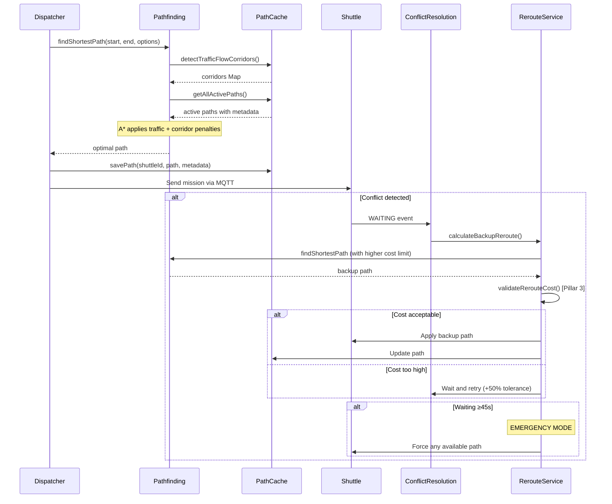

# Logic Endpoint Auto-Mode Shuttle

> **Latest Update**: Implemented 3-Pillar Intelligent Traffic Management System

## Tổng quan
Endpoint `auto-mode` (`/auto-mode`) đóng vai trò là cổng tiếp nhận các tác vụ (task) đi vào hệ thống. Trách nhiệm chính của nó là kiểm tra nghiêm ngặt các yêu cầu gửi đến, phân tách các yêu cầu chứa nhiều hàng hóa thành từng tác vụ riêng lẻ, và đưa chúng vào hàng đợi Redis một cách an toàn để Scheduler xử lý bất đồng bộ sau đó.

Hệ thống được trang bị **3-Pillar Intelligent Traffic Management System** để tối ưu hóa luồng vận chuyển và tránh xung đột:
- **Pillar 1**: Traffic Center (PathCacheService) - Trung tâm điều phối giao thông toàn cục
- **Pillar 2**: Traffic-Aware A* Pathfinding - Tìm đường thông minh với nhận thức giao thông
- **Pillar 3**: Multi-Tier Conflict Resolution - Giải quyết xung đột đa cấp với cost limits động

## Sơ đồ Luồng Logic (Flow Diagram)

```mermaid
flowchart TD
    start([Bắt đầu: HTTP POST /auto-mode]) --> input_check{Input là Mảng?}
    input_check -- Không --> wrap_array[Gói thành Mảng] --> loop_start
    input_check -- Có --> loop_start[Duyệt từng Đối tượng Request]
    
    loop_start --> validate_params{Kiểm tra Tham số<br/>rackId, floorId, pickupNodeQr, listItem}
    validate_params -- Thiếu --> log_skip[Log Cảnh báo & Bỏ qua] --> check_next
    validate_params -- Đủ --> validate_db_rel[Kiểm tra Quan hệ Kệ/Tầng<br/>(Check Database)]
    
    validate_db_rel -- Sai --> log_skip
    validate_db_rel -- Đúng --> validate_qr[Kiểm tra QR Điểm Lấy trên Tầng<br/>(Check Database)]
    
    validate_qr -- Không thấy --> log_skip
    validate_qr -- Tìm thấy --> break_items[Phân tách danh sách 'listItem']
    
    break_items --> item_loop[Duyệt từng Item trong listItem]
    item_loop --> create_task[Tạo Đối tượng Task<br/>- QR Điểm Lấy<br/>- ID Tầng<br/>- Thông tin Item<br/>- Loại Pallet]
    create_task --> redis_push[LPUSH vào Redis<br/>'task:staging_queue']
    redis_push --> item_next{Còn Item?}
    item_next -- Có --> item_loop
    item_next -- Không --> check_next{Còn Request?}
    
    check_next -- Có --> loop_start
    check_next -- Không --> gather_stats[Tổng hợp Thống kê Hàng đợi]
    
    gather_stats --> db_count[Đếm số Push thành công]
    db_count --> redis_len[Lấy độ dài hàng đợi hiện tại]
    redis_len --> response([Phản hồi 202 Accepted<br/>JSON: Success, Counts])
```

## Các Bước Logic Chi Tiết

### 1. Chuẩn hóa Đầu vào (Input Normalization)
Endpoint chấp nhận một đối tượng JSON đơn lẻ hoặc một mảng các đối tượng.
- **Chuẩn hóa**: Nếu đầu vào là một đối tượng, hệ thống sẽ tự động gói nó vào một mảng để thống nhất quy trình xử lý.
- **Kiểm tra sơ bộ**: Nếu body rỗng, trả về lỗi `400 Bad Request`.

### 2. Vòng lặp Kiểm tra Yêu cầu (Request Validation Loop)
Hệ thống duyệt qua từng đối tượng yêu cầu trong mảng. Với mỗi yêu cầu:
- **Kiểm tra Tham số**: Xác minh sự tồn tại của các trường bắt buộc: `rackId`, `floorId`, `pickupNodeQr`, và `listItem` (phải là mảng không rỗng).
- **Tính Toàn vẹn Quan hệ (Relational Integrity)**: 
    - Truy vấn database để đảm bảo `rackId` được cung cấp thực sự thuộc về `floorId` đó.
    - *Hành động khi lỗi*: Nếu không khớp, ghi log cảnh báo và bỏ qua yêu cầu này (hệ thống tiếp tục với yêu cầu tiếp theo).
- **Sự Tồn tại Vật lý**:
    - Truy vấn database để xác minh rằng `pickupNodeQr` (mã QR điểm lấy hàng) có tồn tại cụ thể trên `floorId` được cung cấp hay không.
    - *Hành động khi lỗi*: Nếu không tìm thấy, ghi log cảnh báo và bỏ qua.

### 3. Phân tách và Đưa vào Hàng đợi (Task Staging)
Khi một yêu cầu hợp lệ, hệ thống sẽ tiến hành "phân rã" nó. Một yêu cầu thường chứa danh sách nhiều hàng hóa (ví dụ: 5 thùng hàng trên một pallet) cần được xử lý.
- **Duyệt Item**: Lặp qua mảng `listItem`.
- **Tạo Task**: Với *mỗi* item, một đối tượng task riêng biệt được tạo ra chứa:
    - `pickupNodeQr`: Vị trí lấy hàng.
    - `pickupNodeFloorId`: Tầng lấy hàng.
    - `itemInfo`: Định danh cụ thể của hàng hóa.
    - `palletType`: Phân loại pallet (ví dụ: "6T", "7T").
- **Đẩy vào Redis**: 
    - Task được chuyển đổi sang chuỗi JSON.
    - Được đẩy vào **đầu** (Left) của danh sách Redis: `task:staging_queue`.

### 4. Phản hồi & Thống kê
Sau khi vòng lặp hoàn tất (tất cả các item hợp lệ đã được đẩy vào):
- **Xác nhận**: Hệ thống đợi tất cả các thao tác đẩy vào Redis hoàn thành.
- **Metric Hàng đợi**: Truy vấn độ dài hiện tại của `task:staging_queue` để cung cấp phản hồi thời gian thực.
- **Kết quả cuối cùng**: Trả về HTTP `202 Accepted`.
    - **Body**: Bao gồm số lượng task đã được đưa vào hàng đợi thành công và tổng độ dài hàng đợi hiện tại.

---

# 3-Pillar Intelligent Traffic Management System

## Mục tiêu
Xây dựng một hệ thống không chỉ tìm đường đi ngắn nhất, mà còn có khả năng **"nhìn xa"**, chủ động tránh các khu vực có nguy cơ ùn tắc và bế tắc (deadlock), đồng thời linh hoạt điều chỉnh chiến lược tìm đường dựa trên tình trạng thực tế của giao thông.

## Kiến trúc 3 Trụ Cột

### **Pillar 1: Traffic Center - Trung tâm Điều phối Giao thông**

#### Chức năng
`PathCacheService` đóng vai trò là "Traffic Control Center" toàn cục, lưu trữ và quản lý thông tin về tất cả các tuyến đường đang hoạt động.

#### Các tính năng chính

1. **Global Route Awareness**
   - Lưu trữ path của tất cả shuttle đang di chuyển trong Redis
   - Mỗi path bao gồm: QR code, direction, action cho từng bước
   - TTL (Time-To-Live): 10 phút (có thể cấu hình)

2. **Auto-Cleanup với TTL**
   - Tự động dọn dẹp các path cũ/stale mỗi 30 giây
   - Kiểm tra metadata timestamp và TTL
   - Xóa path của shuttle không hoạt động

3. **Path Metadata Tracking**
   ```javascript
   {
     shuttleId: "001",
     timestamp: 1736381756379,
     ttl: 600000, // ms
     isCarrying: true,
     priority: 1000,
     pathLength: 23
   }
   ```

4. **Traffic Flow Corridor Detection**
   - Phát hiện các "hành lang giao thông" - nơi có nhiều shuttle cùng di chuyển theo 1 hướng
   - Tiêu chí: ≥2 shuttle, ≥70% cùng hướng
   - High-traffic threshold: ≥3 shuttle
   - Sử dụng để áp dụng penalty cao hơn khi đi ngược chiều

#### API chính
- `savePath(shuttleId, pathObject, options)` - Lưu path với metadata
- `getAllActivePaths()` - Lấy tất cả path đang hoạt động (với metadata)
- `detectTrafficFlowCorridors()` - Phát hiện các corridor cao traffic
- `checkCorridorStatus(qrCode, direction)` - Kiểm tra node có trong corridor không

---

### **Pillar 2: Traffic-Aware A* Pathfinding - Tìm đường Nhận thức Giao thông**

#### Chức năng
A* algorithm được nâng cấp để không chỉ tìm đường ngắn nhất mà còn **tránh proactive các khu vực có traffic cao**.

#### Enhanced Traffic Penalty Matrix

**1. Against Traffic (Head-on Collision Risk)**
```
Base penalty: 150
+ 50 nếu shuttle khác đang chở hàng
+ 30 nếu mình rỗng và shuttle khác đang chở
→ Tối đa 230 (ưu tiên cho shuttle có hàng)
```

**2. With Traffic (Following, Congestion)**
```
Empty shuttle: +5
Carrying shuttle: +8 (muốn tránh congestion hơn)
```

**3. Crossing Traffic (Perpendicular)**
```
Base: +15
+ 10 nếu shuttle khác đang chở hàng
→ Tối đa 25
```

#### Corridor Penalty (Pillar 2 đặc biệt)

**Khi phát hiện node nằm trong traffic corridor:**

**Against Corridor Flow:**
```
Normal corridor: +180
High-traffic corridor (≥3 shuttles): +250
→ Penalty CỰC CAO để tránh đi ngược dòng
```

**With Corridor Flow:**
```
Normal: +12
High-traffic: +25 (congestion)
```

**Crossing Corridor:**
```
Normal: +35
High-traffic: +60
```

#### Cách hoạt động
1. Khi tính toán path, A* tự động fetch traffic corridors từ PathCacheService
2. Cho mỗi neighbor node:
   - Tính traffic penalty (dựa trên paths của shuttle khác)
   - Tính corridor penalty (nếu node trong corridor)
   - Tổng cost = base_cost + traffic_penalty + corridor_penalty
3. A* chọn path có tổng cost thấp nhất

---

### **Pillar 3: Multi-Tier Conflict Resolution - Giải quyết Xung đột Đa cấp**

#### Chức năng
Khi shuttle gặp conflict (đụng độ, chờ đợi), hệ thống áp dụng chiến lược **escalating cost limits** - dần dần nới lỏng yêu cầu về độ dài đường thay thế theo thời gian chờ.

#### Tier 1: Base Cost Limits (Dựa trên cargo status)

```javascript
Empty shuttle: Max 200% path increase
Carrying shuttle: Max 140% path increase
→ Shuttle có hàng yêu cầu cao hơn về hiệu quả
```

#### Tier 2: Escalating by Retry Count

```javascript
Retry #1: +50% tolerance
Retry #2: +100% tolerance
Retry #3: +150% tolerance
→ Mỗi lần retry, nới lỏng thêm 50%
```

#### Tier 3: Escalating by Waiting Time

```javascript
Mỗi 15 giây chờ: +50% tolerance
Ví dụ:
- 0-15s: Base limit (140% hoặc 200%)
- 15-30s: Base + 50%
- 30-45s: Base + 100%
- ≥45s: EMERGENCY MODE - chấp nhận bất kỳ path nào
```

#### Emergency Mode (Tier 3 đặc biệt)
- Kích hoạt sau 45 giây chờ đợi
- Bỏ qua tất cả cost limits
- Chấp nhận path bất kể dài đến đâu
- Mục đích: **Tránh deadlock hoàn toàn**

#### Ví dụ thực tế

**Shuttle carrying, chờ 20 giây, retry #1:**
```
Base limit: 140%
Tier 2 bonus: +50% (retry 1)
Tier 3 bonus: +50% (20s / 15s = 1 interval)
→ Total limit: 240%
→ Path mới dài hơn 240% vẫn được chấp nhận
```

**Shuttle empty, chờ 50 giây:**
```
Base limit: 200%
Waiting time: 50s ≥ 45s
→ EMERGENCY MODE activated
→ Chấp nhận bất kỳ path nào
```

---

## Workflow Tổng thể



---

## Configuration

Tất cả tham số có thể điều chỉnh trong `config/shuttle.config.js`:

```javascript
{
  pathCache: {
    defaultTTL: 600,
    cleanupInterval: 30000,
    corridor: { minShuttleCount: 2, dominanceRatio: 0.7 }
  },
  pathfinding: {
    trafficPenalty: { ... },
    corridorPenalty: { ... }
  },
  conflictResolution: {
    tier1: { carrying: 140, empty: 200 },
    tier2: { bonusPerRetry: 50 },
    tier3: { bonusInterval: 15, emergencyTimeout: 45 }
  }
}
```

---

## Log Examples

**Pillar 1 - Traffic Center:**
```
[PathCacheService] Initializing with automatic TTL cleanup...
[PathCacheService] Detected 3 traffic flow corridors out of 12 active nodes
[PathCacheService] Cleanup completed: removed 2 stale path(s)
```

**Pillar 2 - Traffic-Aware Pathfinding:**
```
[Pathfinding] Detected 3 traffic corridors for pathfinding
[Pathfinding] High penalty for X0010Y0020: going up against shuttle 002's direction down (carrying: true)
[Pathfinding] Corridor penalty for X0015Y0025: going against 3-shuttle corridor (dominant dir: 2)
```

**Pillar 3 - Multi-Tier Resolution:**
```
[Reroute][Pillar3] shuttle 001 cost validation [TIER1_CARRYING]: original=23, new=31, increase=34.78%, limit=140%, acceptable=true
[Reroute][Pillar3] Retry bonus: +50% (retry #1)
[Reroute][Pillar3] Waiting time bonus: +50% (waiting 18s)
[Reroute][Pillar3] Shuttle 003 waited 47s - triggering TIER3_EMERGENCY
[Reroute][Pillar3] Emergency flag set, accepting any path for shuttle 003
```

---

## Performance Benefits

1. **Giảm Conflicts**: Traffic-aware pathfinding proactively tránh đụng độ
2. **Giảm Deadlocks**: Emergency mode đảm bảo shuttle luôn có path
3. **Tối ưu Throughput**: Corridor detection tối ưu flow trong high-traffic areas
4. **Fairness**: Empty shuttles nhường đường cho carrying shuttles
5. **Adaptive**: Cost limits tự động điều chỉnh theo tình huống thực tế

---

## Future Enhancements

- [ ] Machine Learning để dự đoán traffic patterns
- [ ] Dynamic TTL dựa trên task complexity
- [ ] Real-time corridor visualization dashboard
- [ ] Historical traffic analysis và optimization
- [ ] Multi-floor traffic coordination
