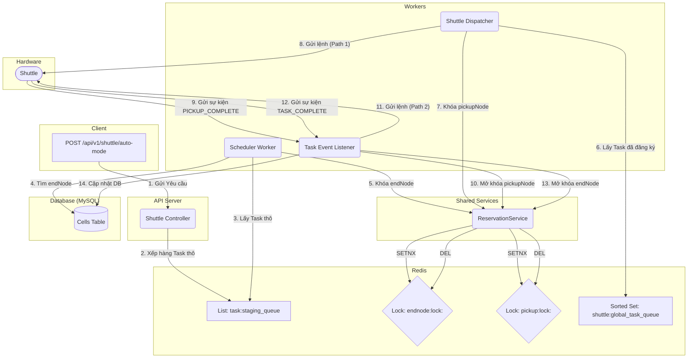

# Kiến trúc Điều Phối Tác Vụ Tự Động (Thiết kế cuối cùng)

## 1. Triết lý thiết kế

Kiến trúc này được xây dựng dựa trên các nguyên tắc của hệ thống phân tán, hướng sự kiện để đảm bảo tính chính xác, khả năng mở rộng và chịu lỗi cao, đồng thời cho phép xử lý gối đầu (pipelining) các tác vụ có chung tài nguyên.

-   **Tách biệt Kế hoạch và Thực tế:**
    -   **Database (MySQL):** Chỉ phản ánh trạng thái vật lý, đáng tin cậy của kho. `is_has_box = 1` nghĩa là đã có hàng. Database không lưu các trạng thái "tương lai" hay "dự định".
    -   **Redis:** Đóng vai trò là một lớp trạng thái tạm thời, tốc độ cao.
        -   **Hàng đợi chờ (Staging Queue):** Lưu các yêu cầu tác vụ thô, đảm bảo thứ tự tiếp nhận (FIFO thời gian).
        -   **Khóa phân tán (Distributed Lock):** Quản lý quyền sử dụng tài nguyên (ô chứa, điểm lấy hàng) tại một thời điểm.

-   **Xử lý gối đầu (Pipelining):** Hệ thống cho phép nhiều tác vụ được xử lý gần như song song bằng cách chỉ khóa các tài nguyên cần thiết (`pickupNode`, `endNode`) trong khoảng thời gian tối thiểu, cho phép các tác vụ tiếp theo bắt đầu ngay khi tài nguyên được giải phóng.

## 2. Các Thành Phần Chính

-   **API Controller:** Điểm tiếp nhận yêu cầu từ bên ngoài.
-   **Redis Staging Queue (`task:staging_queue`):** Hàng đợi các tác vụ thô chưa được gán `endNode`.
-   **Scheduler Worker:** Tiến trình nền, có thể chạy nhiều phiên bản, chịu trách nhiệm lập lịch cho các tác vụ thô.
-   **ReservationService:** Service chung, chịu trách nhiệm đặt và giải phóng khóa tài nguyên trên Redis.
-   **Shuttle Dispatcher:** Tiến trình nền, chịu trách nhiệm tìm shuttle rảnh rỗi và điều phối di chuyển chặng 1.
-   **Task Event Listener:** Lắng nghe các sự kiện từ shuttle để điều phối chặng 2 và hoàn tất tác vụ.

## 3. Luồng Hoạt Động Chi Tiết

### Giai đoạn 1: Tiếp nhận & Xếp hàng (Controller)
1.  **Client** gửi yêu cầu `POST /api/v1/shuttle/auto-mode` chứa một danh sách các item cần cất tại một `pickupNode`.
2.  **`ShuttleController`** nhận yêu cầu, chỉ xác thực thông tin cơ bản. Với mỗi item, nó tạo một "task thô" (chưa có `endNode`) và `LPUSH` vào hàng đợi `task:staging_queue` trong Redis. Việc này đảm bảo các yêu cầu được xếp hàng theo đúng thứ tự FIFO thời gian.

### Giai đoạn 2: Lập lịch & Đặt chỗ `endNode` (Scheduler Worker)
3.  **`SchedulerWorker`** (một tiến trình nền độc lập) lấy một task thô từ `task:staging_queue` (`RPOP`).
4.  Worker truy vấn vào **Database** để tìm một danh sách nhỏ các ô chứa (`cells`) còn trống (`is_block = 0` và `is_has_box = 0`), được sắp xếp theo thứ tự FIFO không gian (tầng, hàng, cột).
5.  Worker lặp qua danh sách `endNode` và dùng **`ReservationService.acquireLock()`** để cố gắng khóa một `endNode` (ví dụ: `endnode:lock:123`).
    -   Nếu thành công, nó đã giành được quyền sử dụng `endNode` này.
    -   Nếu thất bại (do `endNode` đã bị một worker khác khóa), nó sẽ thử với `endNode` tiếp theo trong danh sách.
    -   Nếu không thể khóa được `endNode` nào, nó sẽ đẩy task thô trở lại đầu hàng đợi và thử lại ở chu kỳ sau.
6.  Sau khi khóa thành công, worker sẽ đăng ký một task hoàn chỉnh (đã có `endNode`) vào hàng đợi `shuttle:global_task_queue`.

### Giai đoạn 3: Điều phối & Đặt chỗ `pickupNode` (Dispatcher)
7.  **`ShuttleDispatcherService`** lấy một task đã hoàn chỉnh từ `shuttle:global_task_queue`.
8.  **Logic Pipelining:** Dispatcher dùng **`ReservationService.acquireLock()`** để cố gắng khóa `pickupNode` của task (ví dụ: `pickup:lock:PNA1`).
    -   Nếu `pickupNode` đang bị một task khác khóa (một shuttle khác đang trên đường đến), hàm `acquireLock` sẽ thất bại. Dispatcher sẽ bỏ qua task này và thử lại ở chu kỳ sau.
    -   Nếu khóa thành công, Dispatcher đã giành được quyền cho shuttle đi đến `pickupNode` này.
9.  Dispatcher tìm một shuttle rảnh rỗi, tính toán đường đi chặng 1 (`Path 1`) và gửi lệnh cho **Shuttle**.

### Giai đoạn 4: Thực thi & Giải phóng (Event Listener)
10. **Shuttle** đến `pickupNode`, lấy hàng và gửi sự kiện `PICKUP_COMPLETE`.
11. **`TaskEventListener`** nhận sự kiện này và ngay lập tức gọi **`ReservationService.releaseLock()`** để mở khóa `pickupNode`. **Đây là thời điểm cho phép Dispatcher có thể điều phối task tiếp theo đến `pickupNode` đó.**
12. `TaskEventListener` tính toán đường đi chặng 2 (`Path 2`) và gửi lệnh mới cho shuttle.
13. **Shuttle** đến `endNode`, thả hàng và gửi sự kiện `TASK_COMPLETE`.
14. **`TaskEventListener`** nhận sự kiện cuối cùng này và thực hiện các hành động dọn dẹp:
    -   Gọi `cellService` để cập nhật Database (`is_has_box = 1`).
    -   Gọi **`ReservationService.releaseLock()`** để mở khóa `endNode`.
    -   Cập nhật trạng thái shuttle về `IDLE` trong cache.
    -   Cập nhật trạng thái task thành `completed`.

Quá trình kết thúc, hệ thống sẵn sàng cho tác vụ tiếp theo.